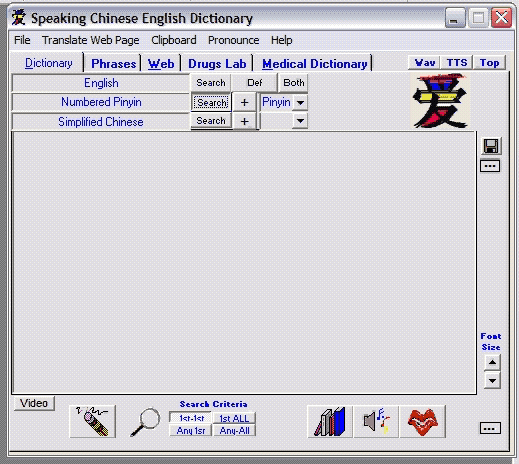



## Everything Chinese, dictionaries, phrases and exercises

### Description

For the student of Chinese or the traveler to the Peoples Republic of China (Mandarin Chinese-Simplified), this is a complete learning utility. It includes a Chinese-English-Pinyin general and medical dictionary. Extensive phrases with an emphasis on medical complaints, allergies and medications. Using SAPI 5.1, everything is pronounced and read in English or Chinese and may be recorded to wav files which then may be converted to mp3's (using the support files: [www.moosenose.com/www.moosenose.com/OCX-EXE.zip]. Extensive help is included. Sapi 5.1 SDK [http://download.microsoft.com/download/speechSDK/SDK/5.1/WXP/EN-US/speechsdk51.exe] and the Asian Language Pack [http://download.microsoft.com/download/speechSDK/SDK/5.1/WXP/EN-US/speechsdk51LangPack.exe] must be installed for the speech functions and the regional settings must be adjusted to PRC Chinese to see the Chinese characters. Online help can be had here: [http://www.moosenose.com/v2.01/PinyinDictionary2.01.htm]. The program uses Tabctl32.ocx &amp; Mp3Enc.ocx [in the downloaded support files] as well as the Richtx32.ocx and WebBrowser controls. The program files (with the dictionaries) is 10 MB and SAPI 5.1 is 83MB &amp; the Language pack is 70MB.
 
### More Info
 

             |
---                |---
**Submitted On**   |2007-07-09 18:18:30
**By**             |[Warren Goff](https://github.com/Planet-Source-Code/PSCIndex/blob/master/ByAuthor/warren-goff.md)
**Level**          |Intermediate
**User Rating**    |5.0 (20 globes from 4 users)
**Compatibility**  |VB 6\.0
**Category**       |[Complete Applications](https://github.com/Planet-Source-Code/PSCIndex/blob/master/ByCategory/complete-applications__1-27.md)
**World**          |[Visual Basic](https://github.com/Planet-Source-Code/PSCIndex/blob/master/ByWorld/visual-basic.md)
**Archive File**   |[Everything207469792007\.zip](https://github.com/Planet-Source-Code/warren-goff-everything-chinese-dictionaries-phrases-and-exercises__1-68970/archive/master.zip)

